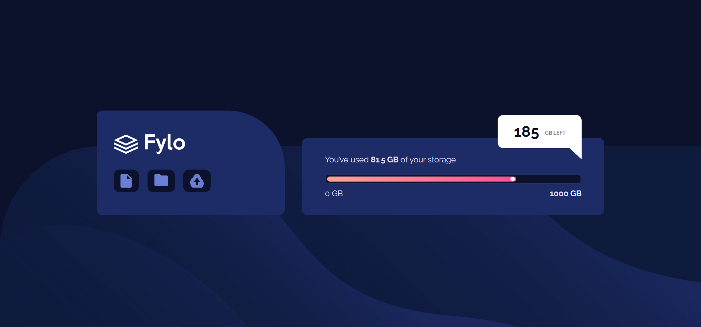

# Frontend Mentor - Fylo data storage component

![Design preview for the Fylo data storage component coding challenge]

## Welcome! 👋

This is a solution to the [Fylo data storage component challenge on Frontend Mentor]

- Solution URL: []
- Live Site URL: []

### Built with

- Semantic HTML5 markup
- CSS custom properties
- Flexbox
- respnsive mobile screen

### What I learned

- meter element
- postion

## Author

- Website - [Asmaa-elfatayry](https://github.com/asmaa-elfatayry)
- Frontend Mentor - [@asmaa-elfatayry](https://www.frontendmentor.io/profile/asmaa-elfatayry)