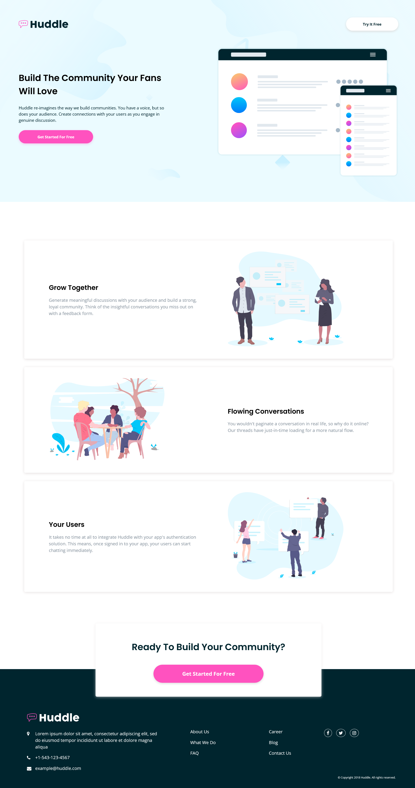

# Frontend Mentor - Huddle landing page with alternating feature blocks

## Welcome! 👋

- Solution URL: https://github.com/asmaa-elfatayry/Frontend-Mentor-Challenges/tree/main/junior/huddle-landing-page-with-alternating-feature-blocks-master
- Live Site URL: https://asmaa-elfatayry.github.io/Frontend-Mentor-Challenges/junior/huddle-landing-page-with-alternating-feature-blocks-master/

### Built with

- Semantic HTML5 markup & SCSS
- CSS custom properties
- Flexbox
- grid
- respnsive mobile screen

## Author

- Website - [Asmaa-elfatayry](https://github.com/asmaa-elfatayry)
- Frontend Mentor - [@asmaa-elfatayry](https://www.frontendmentor.io/profile/asmaa-elfatayry)
